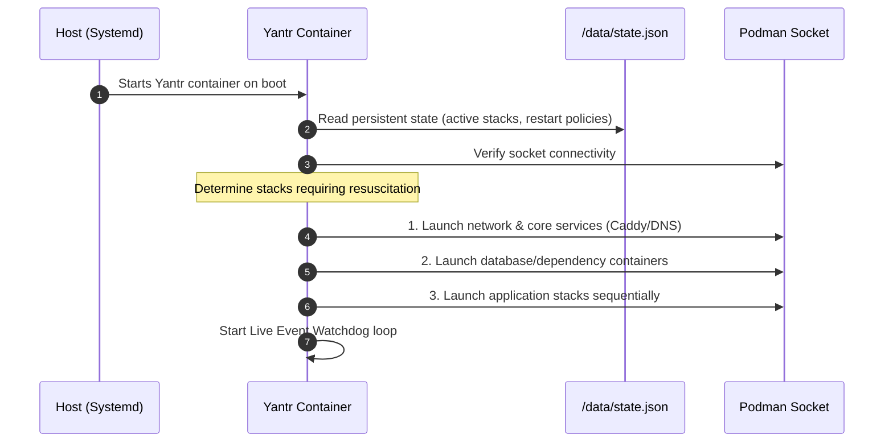

# 📋 Architecture & Implementation Plan: Transitioning Yantr to Podman-Only

## 1. Executive Summary & Core USP

Yantr's defining thesis is:
> **"A self-hosted app store that runs alongside your OS — not instead of it."**

By completely ditching Docker in favor of a **Podman-only architecture**, Yantr becomes the **first 100% rootless, daemonless homelab platform** in the ecosystem.

### The Unique Selling Proposition (USP)
* **Zero Root Privileges:** Runs entirely in unprivileged user space (`UID 1000`). No `sudo`, no dangerous root socket exposure (`/var/run/docker.sock`).
* **Daemonless:** No heavy background daemon running 24/7 as root. Containers are standard Linux processes.
* **Native Systemd Integration:** Apps integrate cleanly with the host OS's native init system (via Quadlets or user units) rather than fighting it.
* **Controlled "Supervisor" Orchestration:** Yantr acts as the state supervisor, orchestrating ordered boot resuscitation and runtime crash recovery without host clutter.

---

## 2. High-Level Architecture

```
┌────────────────────────────────────────────────────────────────────────┐
│                        Host Operating System                           │
│                                                                        │
│   User Session / Systemd (Unprivileged UID 1000)                       │
│   ┌──────────────────────────────────────────────────────────────┐     │
│   │ Podman User Socket: /run/user/1000/podman/podman.sock        │     │
│   └──────────────────────────────┬───────────────────────────────┘     │
│                                  │                                     │
│   ┌──────────────────────────────▼───────────────────────────────┐     │
│   │                      Yantr Container                         │     │
│   │                                                              │     │
│   │  • Vue 3 Web UI (Port 5252)                                  │     │
│   │  • Go REST API Core (Chi router)                             │     │
│   │  • State Supervisor & Resuscitation Engine                   │     │
│   │  • Podman Event Watchdog (In-session auto-restart)          │     │
│   │  • Caddy Reverse Proxy & HTTPS                               │     │
│   │  • Volume File Browser (dufs)                                │     │
│   └───────┬──────────────────────┬───────────────────────┬───────┘     │
│           │                      │                       │             │
│           │ -v yantr_data:/data  │ podman compose        │ mount       │
│           ▼                      ▼                       ▼             │
│   ┌────────────────┐ ┌──────────────────────┐ ┌───────────────────────┐ │
│   │  yantr_data    │ │   App Stacks (350+)  │ │ Rootless Storage      │ │
│   │ • auth.json    │ │  Jellyfin · n8n · …  │ │ ~/.local/share/...    │ │
│   │ • state.json   │ └──────────────────────┘ └───────────────────────┘ │
│   └────────────────┘                                                    │
└────────────────────────────────────────────────────────────────────────┘
```

---

## 3. "Restart Always" & State Resuscitation Engine

Because Podman has no central daemon to restart containers after an OS reboot, **Yantr assumes the role of State Supervisor**.

### 3.1 Host Boot Strategy (Hands-Free Reboot) & Data Persistence
To ensure the homelab boots automatically after power outages without user intervention while preserving credentials:
1. **User Lingering:** Enabled once via `loginctl enable-linger $USER` so user systemd services run at boot without a login session.
2. **Dedicated `yantr_data` Volume:** The installation command mounts a dedicated named volume (`-v yantr_data:/data:Z`). This is crucial because `/data` stores:
   * **Admin Ed25519 Public Key (`/data/auth.json`):** Retains operator login credentials across container recreations, updates, and reboots without lockouts.
   * **State Store (`/data/state.json`):** Tracks which apps should be resurrected upon reboot.
   * **Telemetry & Settings (`/data/telemetry.json`).**
3. **Yantr Host Service:** Yantr itself is registered as the **sole** host systemd user service via a Quadlet (`~/.config/containers/systemd/yantr.container`) or a generated unit (`~/.config/systemd/user/yantr.service`).
4. **Zero Host Clutter:** The host systemd only manages Yantr. The host does *not* have 50 separate service units for individual apps.

#### Canonical Podman Run Command:
```bash
# Create persistent data volume for auth & state
podman volume create yantr_data

# Run Yantr rootless
podman run -d \
  --name yantr \
  --network host \
  -v $XDG_RUNTIME_DIR/podman/podman.sock:/run/podman/podman.sock:z \
  -v yantr_data:/data:z \
  -v $HOME/.local/share/containers/storage/volumes:/var/lib/containers/storage/volumes:z \
  --restart unless-stopped \
  ghcr.io/besoeasy/yantr
```

> **SELinux Note on Flags (`:z` vs `:Z`):**
> * **`:z` (lowercase, shared):** Used on the volume storage mount so Yantr can inspect volume files without locking out other containers. On non-SELinux systems (Ubuntu/Debian), Podman safely ignores `:z` without error.
> * **`:Z` (uppercase, exclusive):** Strictly avoided on the shared storage mount, as it would assign exclusive ownership to Yantr and break application access to their own data.

#### Alternative: Native Systemd Quadlet (`~/.config/containers/systemd/yantr.container`):
```ini
[Unit]
Description=Yantr Rootless Homelab Platform
After=network-online.target

[Container]
ContainerName=yantr
Image=ghcr.io/besoeasy/yantr:latest
Network=host
Volume=%t/podman/podman.sock:/run/podman/podman.sock:z
Volume=yantr_data.volume:/data:z
Volume=%h/.local/share/containers/storage/volumes:/var/lib/containers/storage/volumes:z
AutoUpdate=registry

[Install]
WantedBy=default.target
```

### 3.2 Yantr Boot Resuscitation Sequence
When Yantr starts up after a system reboot:



1. **State Persistence:** Whenever a stack is deployed, stopped, or updated, Yantr records its intended state and restart policy (`always`, `unless-stopped`, `no`) in `/data/state.json`.
2. **Ordered Resuscitation:** Instead of slamming all 50 containers into memory simultaneously (which bottlenecks disk IO and CPU on boot), Yantr brings them up in controlled, sequential batches.
3. **UI Transparency:** The Yantr frontend displays a startup banner if resuscitation is in progress: `Resuming stacks (8/12 online)`.

### 3.3 In-Session Crash Recovery (Live Watchdog)
Podman containers that crash mid-operation (OOM, unhandled errors) are monitored in real time:
* Yantr subscribes to Podman's event stream (`/v1.41/events?filters={"type":["container"],"event":["die"]}`).
* When a container stops unexpectedly with an exit code $\neq 0$:
  * If its policy is `restart: always` or `unless-stopped`, Yantr automatically executes `podman start <container_id>`.
  * Yantr logs the incident to the system activity log and dashboard notifications.

---

## 4. Technical Migration Blueprint (Codebase Changes)

### 4.1 Go Backend (`core/`)

| File / Package | Current (Docker) | New (Podman-Only) |
| :--- | :--- | :--- |
| `core/docker/client.go` | Hardcoded `/var/run/docker.sock` | Refactor to `core/podman/client.go`. Auto-detects `$XDG_RUNTIME_DIR/podman/podman.sock` or `/run/user/<uid>/podman/podman.sock`, falling back to `/run/podman/podman.sock`. |
| `core/main.go` | `getComposeCommand()` checks `docker compose` | Checks `podman compose` exclusively. Sets `DOCKER_HOST` / `PODMAN_HOST` pointing to the Podman socket. |
| `core/supervisor/` *(New)* | None (relies on Docker daemon) | New state engine: loads `/data/state.json`, runs boot resuscitation, and hosts the Podman event watchdog loop. |
| `core/browser.go` | Inspects `/var/lib/docker/volumes` | Inspects Podman volume mountpoints (`~/.local/share/containers/storage/volumes/<name>/_data`) and spawns `dufs`. |
| `entrypoint.sh` | Spawns `containrrr/watchtower` container | Replaced by calling native `podman auto-update` or scheduling updates through Yantr's core supervisor. |

### 4.2 App Templates & Catalog (`apps/`)

All 350+ apps currently use standard `compose.yml` definitions. With `podman compose`, these are largely preserved, with specific adjustments:

* **SELinux & Named Volumes (Automatic):**
  * In Podman, **named volumes** (defined in top-level `volumes:`) are automatically assigned the container file context (`container_file_t`) by Podman upon creation.
  * Because Yantr's authoring rule ([`AGENTS.md`](file:///home/jesus/Code/besoeasy/yantr/AGENTS.md#rule-1-always-use-docker-volumes)) strictly mandates named volumes and forbids host bind mounts (`./data:/data`), **`podman compose` handles SELinux automatically** without requiring manual `:z`/`:Z` flags across the 350+ app compose files.
  * On non-SELinux distributions (Ubuntu/Debian), Podman silently ignores SELinux relabeling flags without raising errors.
* **User Namespace Mapping (`keep-id`):** For apps requiring non-root user IDs (e.g. LinuxServer images with `PUID=1000`), inject `userns_mode: keep-id` to ensure file permissions map directly to the host user without `permission denied` errors.
* **Auto-Update Labels:** Inject `labels: { "io.containers.autoupdate": "registry" }` to enable native Podman image updates.

### 4.3 Low Ports Handling (< 1024)

In rootless Linux, unprivileged users cannot bind to ports below 1024 (e.g. Port 80/443 for Caddy, Port 53 for Pi-hole/AdGuard Home).

**Solution Strategy:**
1. **Default Application Ports:** Keep Yantr's default UI on `5252`.
2. **Reverse Proxy (Caddy):** By default, route external traffic via high ports (e.g., `8080` for HTTP, `8443` for HTTPS) or Cloudflare Tunnel / Tailscale.
3. **One-Time Host Configuration (Optional for port 80/443/53):** Provide a 1-line script for users who want standard low ports:
   ```bash
   echo "net.ipv4.ip_unprivileged_port_start=53" | sudo tee /etc/sysctl.d/99-podman-ports.conf && sudo sysctl --system
   ```

---

## 5. Phase-by-Phase Execution Roadmap

### Phase 1: Engine & Client Refactor
- [ ] Rename `core/docker` to `core/podman`.
- [ ] Implement socket detection for user sockets (`$XDG_RUNTIME_DIR/podman/podman.sock`).
- [ ] Update `getComposeCommand()` to execute `podman compose`.
- [ ] Adapt container inspect, logs, stats, and exec helpers to Podman's API version.

### Phase 2: State Persistence & Resuscitation Engine
- [ ] Create `core/supervisor/state.go` to maintain stack run-states in `/data/state.json`.
- [ ] Implement `core/supervisor/resuscitate.go` to execute ordered stack startup on Yantr launch.
- [ ] Implement `core/supervisor/watchdog.go` listening to Podman's `/events` endpoint for auto-restarting crashed containers.
- [ ] Add boot status indicators to the Vue 3 frontend.

### Phase 3: Packaging & Containerization
- [ ] Update `Dockerfile`: Build base image with Alpine/Fedora-minimal containing `podman`, `podman-compose`, `dufs`, and `caddy`.
- [ ] Update `entrypoint.sh`: Remove Watchtower loop and integrate with Yantr's native updater.
- [ ] Create systemd Quadlet template (`yantr.container`) for 1-step host installation.

### Phase 4: Volume & App Compatibility Validation
- [ ] Update `core/browser.go` to handle rootless Podman volume storage paths.
- [ ] Test representative apps (Nextcloud, Jellyfin, Vaultwarden, AdGuard Home) under rootless Podman.
- [ ] Update `scripts/check.js` and `AGENTS.md` with Podman-specific validation rules.

### Phase 5: Documentation & Re-Branding
- [ ] Update `README.md` and website with new USP ("Rootless, Daemonless, Podman-Powered").
- [ ] Publish rootless Quickstart guide (`podman run` and Quadlet installation).

---

## 6. Verification & Test Plan

1. **Rootless Execution Test:**
   * Start Yantr in a non-root user shell without `sudo`.
   * Verify communication with `$XDG_RUNTIME_DIR/podman/podman.sock`.
2. **App Lifecycle Test:**
   * Deploy multi-container stack (e.g., Nextcloud + PostgreSQL).
   * Verify internal network communication and volume persistence.
3. **Reboot Resuscitation Test:**
   * Kill Yantr container (`podman kill yantr`).
   * Restart Yantr container (`podman start yantr`).
   * Verify that previously running stacks are resurrected in order.
4. **Crash Watchdog Test:**
   * Send `kill -9` to an individual app container.
   * Verify Yantr catches the `die` event and restarts it according to policy.
